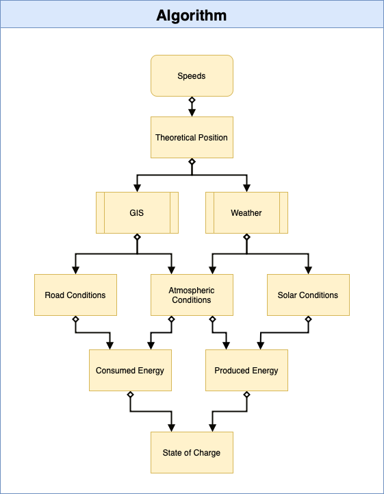

# Simulation

This document describes the high-level architecture of two aspects of UBC Solar's race strategy: simulation and our race strategy algorithm. To learn about our client application see [client repository](https://github.com/UBC-Solar/Simulation-Client).

Our simulation of UBC Solar's solar-powered race cars is a collection of models each representing one component of our car.
They are built from a mix of physics first-principles, modelling and datasheets, and work together to track every Joule of energy. 
Simulation can be thought of as a function that takes in driving speeds as an input, and then simulates the car as it traverses a given competition at those inputted speeds.
Our race strategy algorithm, currently a genetic-algorithm based optimization strategy, uses Simulation to evaluate the performance of 
different driving speeds, given the competition constraints, and will output the ideal (or close to) driving speeds for the competition. Our client ties everything together, giving a user a visual
interface to interact with Simulation and the optimization process, as well as displaying the results of Simulation and comparing it to real-time telemetry data from the competition (WIP).

Simulation is structured in an object-oriented manner, where each component of the car is represented by a module. We 
distinguish between `Consumer`s that consume energy, and `Producer`s which produce energy: together they comprehensively 
simulate and track the energy state of the car. `Storage` models are used to model the storing and drawing of power. 
Additionally, various external data collectors acquire and process environment data to create a full picture of the physical situation 
that our vehicle will be existing in, and the road conditions it will be traversing.

We simulate our vehicle by dividing the competition period into discrete time steps, giving us a finite and discrete number of moments (tick) to simulate. 
Simulation begins by taking the input of driving speeds and making the critical assumption that driving at those speeds for the duration of the competition is physically achievable.
Therefore, we can obtain the theoretical position of the car at every tick. Thus, we then map each tick to a weather forecast and a path coordinate (we have vastly fewer of each than we do ticks, so we map each tick to the closest).
From that, we can ascertain the road gradient, cloud cover, wind speed and direction, vehicle bearings, and elevation of the car at every tick.
Then, we can calculate the power that the motor will require to achieve the required speed at every tick, and the solar irradiance experienced and the energy that our solar arrays will capture at every tick. 
Thus, we can determine the amount of energy that will be drawn or stored in the battery at every tick, which allows us to determine the state of charge of the battery for every tick.
Finally, we check if our assumption was right, that we would have enough energy to achieve the speeds that we set out to achieve, and if we were correct then simulation is completed, and was successful.
